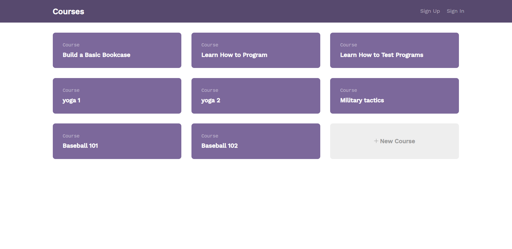
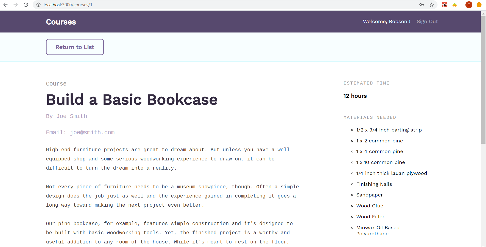
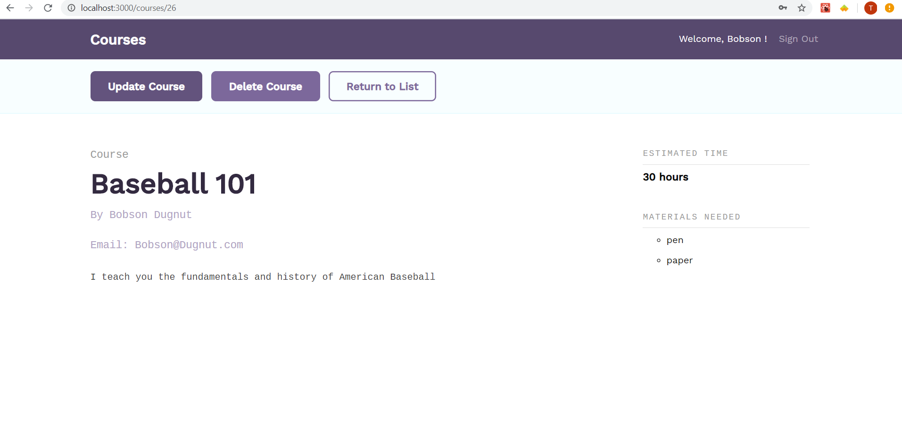

# fullstackApi

A UI that contains information on courses. Logging in provides extra functionality to the app.

# Project requirements

* Include user authentication
* configure global state at the top of the APP (React's context API was implement)
* Implement private routes
* Only render update/delete buttons and allow updates/deletes if the users is the course creator
* Forms render validation errors received from the REST API
* App data is persisted with cookies


# Install
run these commands inside both the api and client folder
```
npm install
npm start
```

# Project outline

* root page



* view course details as anonymous user



* view course details as course owner


* course update page and example of validation in the app

